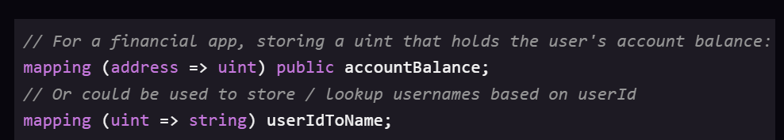

# CryptoZombies - Bài 2: Zombies Tấn Công Khởi Nghĩa (Zombies Attack Their Victims)

## Chương 1 & 2: Address và Mapping
### Address (Địa chỉ)
Blockchain Ethereum bao gồm các **tài khoản (accounts)**, giống như các tài khoản ngân hàng. Mỗi tài khoản có số dư **Ether** (loại tiền tệ trên Ethereum) và có một địa chỉ định danh duy nhất (ví dụ: `0x0cE446255506E92DF41614C46F1d6df9Cc969183`). Địa chỉ này đại diện cho quyền sở hữu đối với các tài sản hoặc smart contract.

### Mapping (Ánh xạ)
**Mapping** là một cấu trúc dữ liệu quan trọng trong Solidity, tương tự như Hash Map hoặc Dictionary trong các ngôn ngữ khác. Nó lưu trữ dữ liệu dưới dạng cặp `key-value` (khóa-giá trị).
Ví dụ: Bạn có thể ánh xạ một địa chỉ (Address) đến một số dư (uint).

```solidity
// Lưu trữ số dư của một địa chỉ
mapping (address => uint) public accountBalance;

// Lưu trữ ID của zombie thuộc về một địa chỉ
mapping (uint => address) public zombieToOwner;
```



---

## Chương 3: `msg.sender`
Trong Solidity, có những biến toàn cục (global variables) luôn tồn tại và có thể được gọi ở bất kỳ đâu. Một trong những biến quan trọng nhất là `msg.sender`.

`msg.sender` đại diện cho **địa chỉ của người (hoặc smart contract) đã gọi hàm hiện tại**.
*Lưu ý:* Trong Solidity, việc thực thi luôn bắt đầu từ một người gọi bên ngoài. Một smart contract không thể tự nhiên chạy, nó cần có một giao dịch kích hoạt từ một `msg.sender`.

---

## Chương 4: `require`
Hàm `require` dùng để kiểm tra điều kiện trước khi thực thi phần còn lại của hàm. Nếu điều kiện là `false`, hàm sẽ lập tức dừng lại và ném ra một lỗi (throw an error), đồng thời hoàn trả (revert) mọi thay đổi đã thực hiện trước đó trong hàm.

```solidity
function sayHiToVitalik(string memory _name) public returns (string memory) {
  // Chỉ thực thi tiếp nếu _name bằng "Vitalik"
  require(keccak256(abi.encodePacked(_name)) == keccak256(abi.encodePacked("Vitalik")));
  return "Hi!";
}
```

---

## Chương 5 & 6: Kế thừa (Inheritance) và Import
### Kế thừa (Inheritance)
Để code gọn gàng và dễ quản lý hơn, Solidity hỗ trợ tính **kế thừa**. Bạn có thể tách logic ra nhiều contract khác nhau, và cho phép một contract con kế thừa tất cả các hàm và biến `public`/`internal` từ contract cha.

```solidity
contract ZombieFactory {
  // Logic cơ bản của Zombie
}

contract ZombieFeeding is ZombieFactory {
  // Kế thừa toàn bộ từ ZombieFactory
}
```

### Import
Khi code quá dài, bạn nên chia nó ra thành nhiều file. Bạn có thể sử dụng từ khóa `import` để mang code từ file khác vào file hiện tại.

```solidity
import "./zombiefactory.sol";
```


---

## Chương 7: Storage vs Memory
Trong Solidity, có hai nơi chính để lưu trữ các biến cấu trúc (như array, struct):

1. **Storage (Lưu trữ vĩnh viễn):** Dữ liệu được lưu vĩnh viễn trên blockchain (giống như ổ cứng HDD). Việc ghi vào storage tốn rất nhiều gas.
2. **Memory (Lưu trữ tạm thời):** Dữ liệu chỉ tồn tại tạm thời trong quá trình thực thi hàm (giống như RAM). Khi hàm chạy xong, dữ liệu bị xóa. Việc thao tác với memory tốn ít gas hơn nhiều.

*Sự khác biệt khi gán biến:*
- **Khai báo Storage:** Nó tạo ra một **con trỏ (pointer)** trỏ trực tiếp đến dữ liệu trên blockchain. Việc thay đổi biến này sẽ **thay đổi trực tiếp** dữ liệu gốc.
- **Khai báo Memory:** Nó tạo ra một **bản sao (copy)** của dữ liệu. Mọi thao tác thay đổi trên bản sao này **không ảnh hưởng** đến dữ liệu trên blockchain, trừ khi bạn gán nó ngược lại vào storage.

```solidity
// Khai báo storage: s trỏ trực tiếp vào sandwiches[0]
Sandwich storage s = sandwiches[0];
s.status = "Eaten!"; // Thay đổi lưu thẳng lên blockchain

// Khai báo memory: m là một bản sao
Sandwich memory m = sandwiches[1];
m.status = "Eaten!"; // Chỉ thay đổi ở biến tạm
sandwiches[1] = m;   // Phải gán lại vào mảng nếu muốn lưu lên blockchain
```

---

## Chương 8 & 9: Function Visibility (Quyền truy cập hàm)
Solidity cung cấp 4 cấp độ quyền truy cập cho hàm:
1. **`private`:** Chỉ có thể gọi từ bên trong **chính contract** đã định nghĩa nó.
2. **`internal`:** Giống `private`, nhưng cho phép các **contract kế thừa** (con) cũng có thể gọi.
3. **`public`:** Có thể gọi từ **bất cứ đâu** (bên trong, bên ngoài, contract con).
4. **`external`:** Chỉ có thể gọi từ **bên ngoài** contract. Hàm này không thể gọi nội bộ (trừ khi dùng `this.functionName()`).

Nếu một hàm không dùng để gọi từ bên ngoài, việc sử dụng `internal` (thay vì `private`) là cần thiết nếu bạn dự định tạo các contract khác kế thừa và cần sử dụng lại hàm đó.

---

## Chương 10 & 11: Tương tác với Contract Khác qua Interface
Smart contract của bạn có thể tương tác với bất kỳ contract nào khác trên Ethereum, miễn là các hàm của contract đó ở trạng thái `public` hoặc `external`.
Để làm được điều này, bạn cần định nghĩa một **Interface** (Giao diện).

Interface giống như một bản phác thảo, nói cho contract của bạn biết:
- Contract kia có hàm tên gì?
- Hàm đó nhận đầu vào là gì?
- Nó trả về kiểu dữ liệu nào?

Đặc điểm của Interface:
1. Chỉ có phần khai báo tên hàm, không có `{}` và không chứa phần thân (body) của hàm.
2. Trông giống hệt contract thông thường nhưng không có code thực thi.

**Cách dùng Interface:**
```solidity
// 1. Định nghĩa Interface
contract NumberInterface {
  function getNum(address _myAddress) public view returns (uint);
}

// 2. Gọi interface trong contract của bạn
contract MyContract {
  address numberContractAddress = 0xab38...; // Địa chỉ contract trên blockchain
  
  // Khởi tạo interface trỏ tới địa chỉ
  NumberInterface numberContract = NumberInterface(numberContractAddress);

  function getLuckyNumber() public {
    // Gọi hàm từ contract khác
    uint num = numberContract.getNum(msg.sender);
  }
}
```

---

## Chương 12: Xử lý nhiều giá trị trả về (Multiple Returns)
Trong Solidity, một hàm có thể trả về **nhiều giá trị cùng lúc**.

```solidity
function multipleReturns() internal returns(uint a, uint b, uint c) {
  return (1, 2, 3);
}

function processMultipleReturns() external {
  uint a;
  uint b;
  uint c;
  // Lấy toàn bộ giá trị
  (a, b, c) = multipleReturns();
  
  // Nếu chỉ muốn lấy giá trị cuối cùng, bỏ trống các biến không cần thiết
  (,,c) = multipleReturns();
}
```

---

## Chương 13: CryptoKitties DNA & Chuỗi (Strings)
Khi zombie lây nhiễm một chú mèo CryptoKitty, DNA của zombie mới sẽ là sự pha trộn giữa zombie cũ và chú mèo. Để đánh dấu zombie có nguồn gốc từ mèo, chúng ta sẽ để 2 chữ số cuối cùng trong chuỗi DNA của nó là `99`.

Để làm việc này, chúng ta truyền thêm tham số `_species` dưới dạng `string` để kiểm tra.
**Lưu ý khi so sánh String trong Solidity:**
Bạn không thể so sánh string trực tiếp bằng `==`. Thay vào đó, bạn phải chuyển chuỗi thành mã hash `keccak256` rồi mới so sánh.

```solidity
// So sánh chuỗi đúng cách
if (keccak256(abi.encodePacked(_species)) == keccak256(abi.encodePacked("kitty"))) {
  // Thay thế 2 chữ số cuối bằng 99
  newDna = newDna - (newDna % 100) + 99;
}
```
*Giải thích logic đổi số cuối thành 99:* Nếu DNA là `334455`, `334455 % 100 = 55`. `334455 - 55 = 334400`. `334400 + 99 = 334499`.

---

## Chương 14: Tổng kết - Frontend Web3.js
Khi contract của bạn được deploy lên Ethereum, bạn có thể tương tác với nó thông qua giao diện người dùng (Frontend) sử dụng thư viện **Web3.js** của JavaScript.

Cách hoạt động cơ bản:
1. Giao diện người dùng gọi các hàm (tấn công mèo) thông qua kết nối `web3.eth.contract`.
2. Lấy hình ảnh của mèo thông qua Web API thông thường (không nằm trên blockchain).
3. Lắng nghe các sự kiện (Events) như `NewZombie` phát ra từ Smart Contract để tự động hiển thị kết quả lên giao diện web.

```javascript
// Khởi tạo kết nối tới contract
var ZombieFeeding = web3.eth.contract(abi).at(contractAddress);

// Bắt sự kiện khi người dùng chọn 1 con mèo
$(".kittyImage").click(function(e) {
  ZombieFeeding.feedOnKitty(zombieId, kittyId);
});

// Lắng nghe Event từ Smart Contract để hiển thị Zombie mới
ZombieFactory.NewZombie(function(error, result) {
  if (error) return;
  generateZombie(result.zombieId, result.name, result.dna);
});
```
Tóm lại: Giao tiếp giữa JS và Smart Contract mang lại trải nghiệm liền mạch cho người dùng game.
