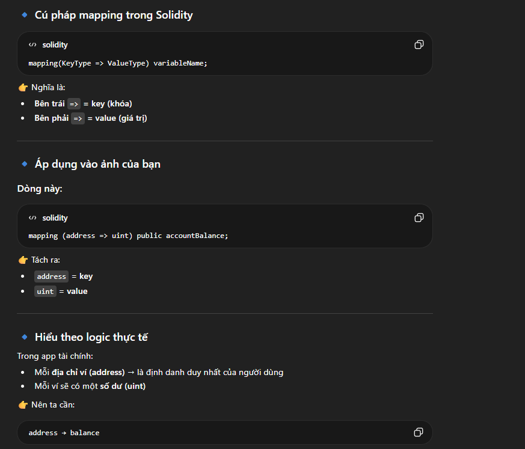
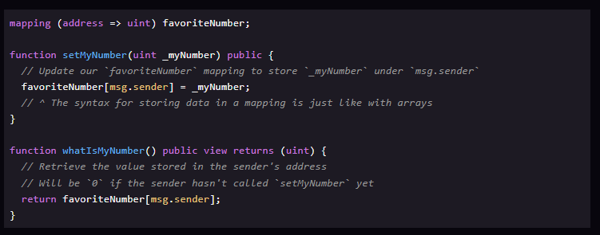
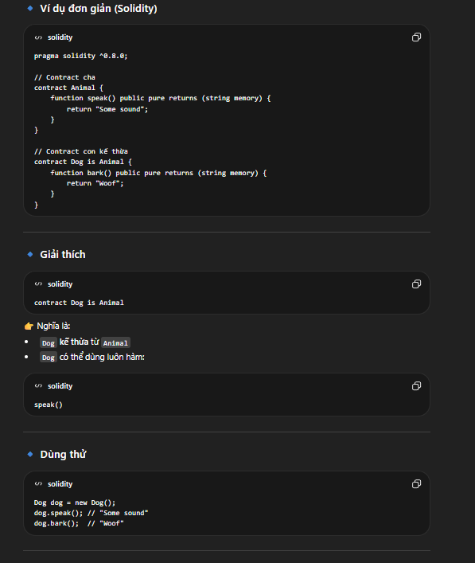
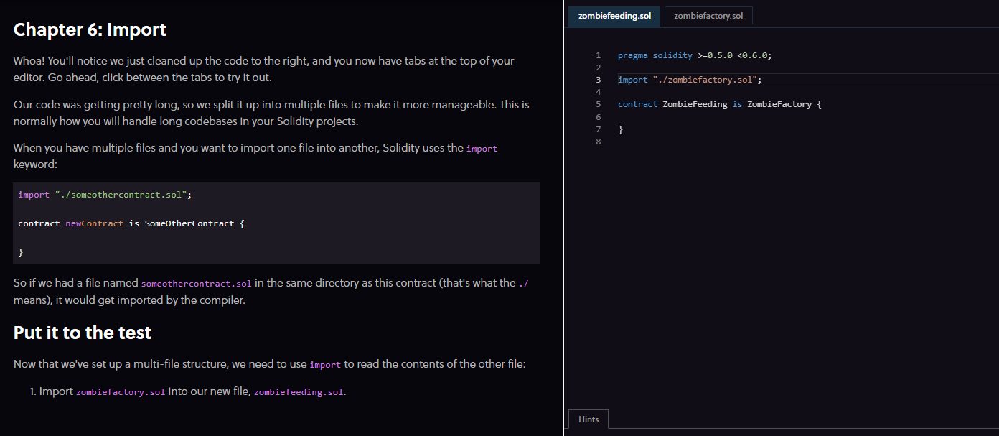

# Chapter 2

## Addresses 

ETH blockchain is made up of **account** like bank. Each account has **Ether** like money (can send and receive) and it like this : **0x0cE446255506E92DF41614C46F1d6df9Cc969183** and it unique

## Mapping 
Mapping is an another way to storing organizing data in solidity
>[!image](image.png)

it like mapping in math, ex you have a Address which name A , it mapping a balance 0. B mapping 1, C mapping 2 and continue.

# chapter 3 : Msg.sender

msg.sender là gì? TRong solidity có một số biến toàn cục (global variables) có thể dùng ở mọi hàm . Một trong số đó là msg.sender.
msg.sender là địa chỉ (address) của người(hoặc smart contract) đã gọi hàm hiện tại.

Trong solidity , mọi hàm đều phải được gọi từ bên ngoài.
Smart contract không tự chạy, nó chỉ chạy khi có ai gọi .

VÌ vậy : luôn tồn tại một msg.sender
dưới đây là ví dụ:

# chapter 4 : REquire
đây là hàm khởi tạo lỗi

# chapter 5 : inheritance (kế thừa )
cùng nhìn ví dụ dưới để ôn lại OOP một chút

# chapter 6 : import

# chapter 7 : storage vs memory
Trong Solidity có 2 nơi lưu biến:

🧱 Storage
Lưu vĩnh viễn trên blockchain
Giống như ổ cứng (hard disk)
⚡ Memory
Lưu tạm thời
Bị xóa sau khi hàm chạy xong
Giống như RAM

Mặc định của Solidity
Biến khai báo ngoài hàm → storage
Biến trong hàm → memory

👉 Thường bạn không cần ghi rõ, Solidity tự hiểu.

Khi nào phải ghi rõ?

👉 Khi làm việc với:

struct
array\

🔹 Ví dụ trong code
Sandwich storage mySandwich = sandwiches[_index];

👉 Nghĩa là:

mySandwich KHÔNG phải bản copy
→ mà là con trỏ (pointer) tới dữ liệu thật trong blockchain

📌 Khi sửa:
mySandwich.status = "Eaten!";

👉 Sẽ:

THAY ĐỔI TRỰC TIẾP dữ liệu trong blockchain
🔹 Ngược lại: dùng memory
Sandwich memory anotherSandwich = sandwiches[_index + 1];

👉 Đây là:

một bản copy

📌 Khi sửa:
anotherSandwich.status = "Eaten!";

👉 Chỉ thay đổi:

biến tạm → KHÔNG ảnh hưởng blockchain
📌 Nếu muốn lưu lại:
sandwiches[_index + 1] = anotherSandwich;

👉 Lúc này mới ghi vào blockchain

🔥 Giải thích dễ hiểu (quan trọng)
🧠 So sánh cực dễ
Loại	Ví dụ đời thực
storage	Google Drive
memory	file tạm trên RAM
🔹 Hình dung
🧱 storage
sandwiches[0] → {name: "Bánh mì", status: "Fresh"}
Sandwich storage s = sandwiches[0];

👉 s = trỏ thẳng vào sandwiches[0]

⚡ memory
Sandwich memory s = sandwiches[0];

👉 s = bản copy:

s → {name: "Bánh mì", status: "Fresh"}
⚠️ Điểm quan trọng nhất
storage	memory
sửa → ảnh hưởng blockchain	sửa → không ảnh hưởng
pointer	copy
tốn gas	ít tốn hơn

# chapter 8 : Đọc code là chính 
'''solidity
pragma solidity >=0.5.0 <0.6.0;

import "./zombiefactory.sol";

contract ZombieFeeding is ZombieFactory {

  function feedAndMultiply(uint _zombieId, uint _targetDna) public {
    require(msg.sender == zombieToOwner[_zombieId]);
    Zombie storage myZombie = zombies[_zombieId];
    _targetDna = _targetDna % dnaModulus;
    uint newDna = (myZombie.dna + _targetDna) / 2;
    _createZombie("NoName", newDna);
  }

}
'''

# chapter 9: More on Function Visibility

🔹 Lỗi trong bài trước

Code trước bị lỗi vì:

Bạn gọi hàm _createZombie từ contract khác,
nhưng _createZombie được khai báo là private

👉 Mà private thì:

❌ Contract khác (kể cả kế thừa) KHÔNG gọi được
🔹 Các mức độ visibility (quyền truy cập)

Solidity có 4 loại:

🔸 1. private

👉 Chỉ dùng trong chính contract đó

function foo() private {}
❌ Contract con không dùng được
❌ Bên ngoài không gọi được
🔸 2. internal

👉 Giống private nhưng:

✔️ Contract con dùng được
🔸 3. public

👉 Ai cũng gọi được:

✔️ Bên ngoài
✔️ Bên trong
✔️ Contract con
🔸 4. external

👉 Chỉ gọi từ bên ngoài

✔️ Người dùng gọi được
❌ Không gọi nội bộ được (trừ khi dùng this.)
🔥 Ví dụ trong bài
contract Sandwich {
  uint private sandwichesEaten = 0;

  function eat() internal {
    sandwichesEaten++;
  }
}

👉 Hàm eat() là internal

contract BLT is Sandwich {
  uint private baconSandwichesEaten = 0;

  function eatWithBacon() public returns (string memory) {
    baconSandwichesEaten++;
    eat(); // gọi được vì internal
  }
}
🔹 Giải thích

👉 BLT kế thừa Sandwich

contract BLT is Sandwich

👉 Vì eat() là internal nên:

✔️ Contract con gọi được

eat();

# chapter 10: 

Zombie ăn gì?

Zombies trong game sẽ ăn…
👉 CryptoKitties 😱

👉 Nhưng:

Không phá hay xóa gì cả
Chỉ đọc dữ liệu (DNA) từ contract CryptoKitties trên blockchain
🔹 Tương tác với contract khác

Muốn contract của bạn gọi contract khác, bạn cần:

👉 Interface (giao diện)

🔹 Ví dụ trong bài

Có 1 contract như này:

contract LuckyNumber {
  mapping(address => uint) numbers;

  function setNum(uint _num) public {
    numbers[msg.sender] = _num;
  }

  function getNum(address _myAddress) public view returns (uint) {
    return numbers[_myAddress];
  }
}

👉 Nghĩa là:

Ai cũng lưu được số may mắn
Ai cũng tra được số của người khác
🔹 Contract khác muốn đọc dữ liệu

👉 Bạn phải tạo interface:

contract NumberInterface {
  function getNum(address _myAddress) public view returns (uint);
}
🔥 Giải thích Interface (quan trọng)

👉 Interface giống như:

"bản mô tả cách gọi hàm"
🔹 Điểm đặc biệt
❗ 1. Chỉ khai báo hàm
function getNum(address _myAddress) public view returns (uint);

👉 Không có { }

❗ 2. Không có code bên trong

👉 Chỉ có:

tên hàm + input + output
🔹 Tại sao cần interface?

👉 Vì contract của bạn:

❌ Không biết code bên trong contract kia
✔️ Chỉ cần biết:
có hàm gì
gọi như nào
trả về gì
🧠 Hiểu cực đơn giản
📞 Ví dụ đời thật

👉 Interface giống như:

API / số điện thoại

Bạn không cần biết:

người kia làm gì bên trong

Bạn chỉ cần biết:

gọi số này → nhận kết quả
🔹 Áp dụng vào CryptoKitties

👉 Bạn sẽ tạo interface kiểu:

contract KittyInterface {
  function getKitty(uint256 _id) external view returns (...);
}

👉 Sau đó:

gọi contract CryptoKitties
lấy DNA
🔥 Tóm lại

👉 Interface = “bản mô tả cách gọi contract khác”

không có code
chỉ có khai báo hàm

# chapter 11:

Tiếp tục ví dụ trước với NumberInterface, sau khi chúng ta định nghĩa interface như sau:

contract NumberInterface {
  function getNum(address _myAddress) public view returns (uint);
}

Chúng ta có thể sử dụng nó trong một contract khác như sau:

contract MyContract {
  address NumberInterfaceAddress = 0xab38...
  // ^ Đây là địa chỉ của contract FavoriteNumber trên Ethereum

  NumberInterface numberContract = NumberInterface(NumberInterfaceAddress);
  // Bây giờ `numberContract` đang trỏ tới contract kia

  function someFunction() public {
    // Giờ ta có thể gọi hàm `getNum` từ contract đó:
    uint num = numberContract.getNum(msg.sender);
    // ...và làm gì đó với biến `num` ở đây
  }
}
🔹 Ý nghĩa

Bằng cách này, contract của bạn có thể:

👉 Tương tác với bất kỳ contract nào khác trên blockchain Ethereum

Miễn là:

các hàm của contract đó được khai báo là public hoặc external

# chapter 12 
Chapter 12: Handling Multiple Return Values
This getKitty function is the first example we've seen that returns multiple values. Let's look at how to handle them:

function multipleReturns() internal returns(uint a, uint b, uint c) {
  return (1, 2, 3);
}

function processMultipleReturns() external {
  uint a;
  uint b;
  uint c;
  // This is how you do multiple assignment:
  (a, b, c) = multipleReturns();
}

// Or if we only cared about one of the values:
function getLastReturnValue() external {
  uint c;
  // We can just leave the other fields blank:
  (,,c) = multipleReturns();
}

# cahpter 13
Bonus: Kitty Genes (DNA mèo)

Logic hàm của chúng ta đã hoàn thành… nhưng hãy thêm một tính năng nhỏ 🎁

👉 Làm cho zombie tạo từ mèo có đặc điểm riêng (cat-zombie)

🔹 Ý tưởng
DNA zombie có 16 chữ số
Hiện tại chỉ dùng 12 số đầu
👉 Còn 2 số cuối chưa dùng

💡 Quy ước:

Nếu zombie ăn mèo → 2 số cuối = 99
(vì mèo có 9 mạng 😆)
🔹 If trong Solidity

Giống JavaScript:

if (điều kiện) {
  // làm gì đó
}
🔹 So sánh string (quan trọng ⚠️)

👉 Không thể so sánh string trực tiếp:

❌ Sai:

if (_species == "kitty")

👉 Phải dùng hash:

if (keccak256(abi.encodePacked(_species)) == keccak256(abi.encodePacked("kitty")))
🔹 Nhiệm vụ cần làm
🧩 1. Thêm tham số _species
function feedAndMultiply(uint _zombieId, uint _targetDna, string memory _species)
🧩 2. Thêm if
if (keccak256(abi.encodePacked(_species)) == keccak256(abi.encodePacked("kitty"))) {
    newDna = newDna - newDna % 100 + 99;
}
🔥 Giải thích dòng quan trọng nhất
newDna = newDna - newDna % 100 + 99;

👉 Mục tiêu:

đổi 2 chữ số cuối thành 99

🧠 Ví dụ
newDna = 334455

👉 Bước 1:

newDna % 100 = 55

👉 Bước 2:

334455 - 55 = 334400

👉 Bước 3:

334400 + 99 = 334499

✔️ Done ✅

🔹 3. Sửa hàm gọi
feedAndMultiply(_zombieId, kittyDna, "kitty");
🔥 Tóm lại

👉 Nếu:

_species == "kitty"

👉 Thì:

DNA → kết thúc bằng 99

Chapter 14: Tổng kết

Vậy là bạn đã hoàn thành Lesson 2 🎉

Bạn có thể xem demo bên phải để thấy nó hoạt động.
Hãy thử click vào một con mèo để tấn công, và xem zombie mới được tạo ra!

🔹 Triển khai bằng JavaScript

Khi sẵn sàng deploy contract lên Ethereum:

👉 Bạn chỉ cần deploy:

ZombieFeeding

Vì:

Đây là contract cuối cùng
Nó kế thừa từ ZombieFactory
Có quyền truy cập tất cả hàm public
🔹 Ví dụ dùng JavaScript (web3.js)
var abi = /* ABI từ compiler */
var ZombieFeedingContract = web3.eth.contract(abi)
var contractAddress = /* địa chỉ contract sau khi deploy */
var ZombieFeeding = ZombieFeedingContract.at(contractAddress)

👉 Kết nối tới contract đã deploy

🔹 Chuẩn bị dữ liệu
let zombieId = 1;
let kittyId = 1;
🔹 Lấy ảnh CryptoKitty
let apiUrl = "https://api.cryptokitties.co/kitties/" + kittyId
$.get(apiUrl, function(data) {
  let imgUrl = data.image_url
})

👉 Lưu ý:

Ảnh không nằm trên blockchain
Mà nằm trên server riêng
🔹 Khi user click
$(".kittyImage").click(function(e) {
  ZombieFeeding.feedOnKitty(zombieId, kittyId)
})

👉 Gọi hàm smart contract:

zombie ăn mèo 🐱
🔹 Lắng nghe event
ZombieFactory.NewZombie(function(error, result) {
  if (error) return
  generateZombie(result.zombieId, result.name, result.dna)
})

👉 Khi tạo zombie mới:

nhận event
hiển thị lên UI
🔥 Trải nghiệm game

👉 Khi bạn chọn 1 con mèo:

DNA zombie + DNA mèo → zombie mới

👉 Nếu là mèo:

DNA kết thúc bằng 99 🐱

👉 Vì vậy zombie có:

chân mèo 😆
🔹 Lưu ý
Bạn chỉ giữ được 1 zombie
Có thể chơi lại để tạo zombie đẹp hơn
🔥 Tóm lại
Frontend (JS) ↔ Smart Contract ↔ Blockchain
JS gọi contract
Contract xử lý logic
Event trả về UI
💡 Tóm gọn 1 câu
Click mèo → gọi contract → tạo zombie mới → hiển thị lên web